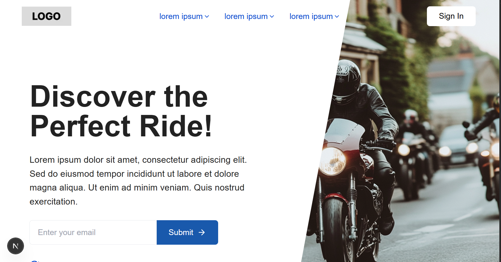
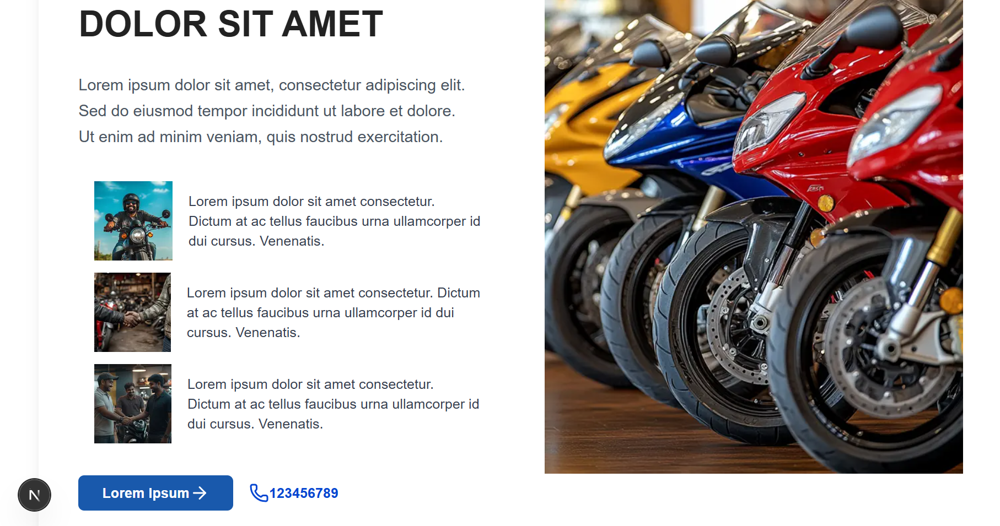
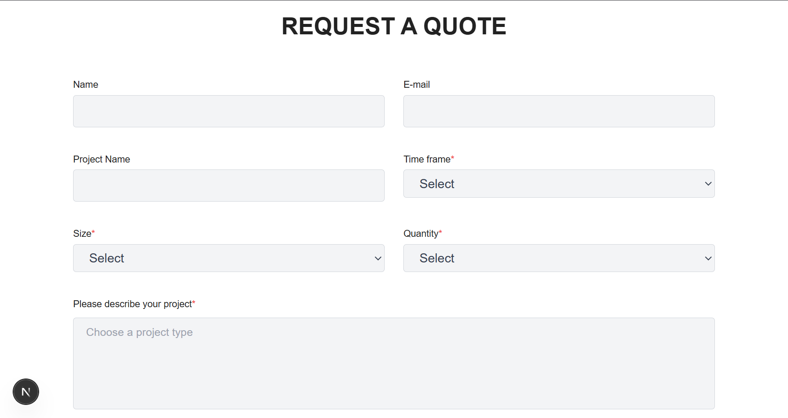

# 🚀 Project Title
A modern and responsive landing page for [project/client name] built using **Next.js**, **Tailwind CSS**, and **Framer Motion**.

---

## 🔍 Features

- Responsive Layout
- Smooth Scroll Animations (Framer Motion / GSAP)
- Clean UI with Tailwind CSS
- Dark Mode (if included)
- Deployed on Vercel

---

## 📸 Screenshots






---

## 🛠️ Tech Stack

- Next.js (App Router)
- Tailwind CSS
- Framer Motion / GSAP
- GitHub + Vercel

---

## 🔧 Setup Instructions

```bash
git clone https://github.com/Yadu1shi/project1.git
cd project1
npm install
npm run dev
